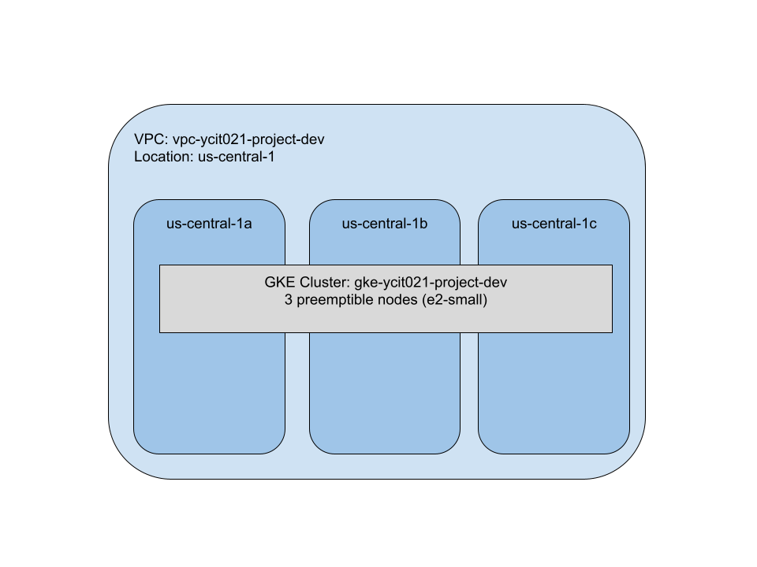

<!-- BEGIN_TF_DOCS -->

## Requirements

| Name | Version |
|------|---------|
|  [google](#requirement\_google) | ~> 3.70.0 |
|  [google-beta](#requirement\_google-beta) | ~> 3.70.0 |

## Providers

| Name | Version |
|------|---------|
|  [google](#provider\_google) | 3.70.0 |
|  [google-beta](#provider\_google-beta) | 3.70.0 |

## Modules

No modules.

## Resources

| Name | Type |
|------|------|
| [google-beta_google_container_cluster.primary_cluster](https://registry.terraform.io/providers/hashicorp/google-beta/latest/docs/resources/google_container_cluster) | resource |
| [google-beta_google_container_node_pool.preemptible-node_pool](https://registry.terraform.io/providers/hashicorp/google-beta/latest/docs/resources/google_container_node_pool) | resource |
| [google_compute_address.regional_external_ip](https://registry.terraform.io/providers/hashicorp/google/latest/docs/resources/compute_address) | resource |
| [google_compute_firewall.ssh-rule](https://registry.terraform.io/providers/hashicorp/google/latest/docs/resources/compute_firewall) | resource |
| [google_compute_network.vpc_network](https://registry.terraform.io/providers/hashicorp/google/latest/docs/resources/compute_network) | resource |
| [google_compute_router.gke_net_router](https://registry.terraform.io/providers/hashicorp/google/latest/docs/resources/compute_router) | resource |
| [google_compute_router_nat.gke_cloud_nat](https://registry.terraform.io/providers/hashicorp/google/latest/docs/resources/compute_router_nat) | resource |
| [google_compute_subnetwork.gke_private_subnet](https://registry.terraform.io/providers/hashicorp/google/latest/docs/resources/compute_subnetwork) | resource |
| [google_project_service.compute](https://registry.terraform.io/providers/hashicorp/google/latest/docs/resources/project_service) | resource |
| [google_project_service.gke_api](https://registry.terraform.io/providers/hashicorp/google/latest/docs/resources/project_service) | resource |

## Inputs

| Name | Description | Type | Default | Required |
|------|-------------|------|---------|:--------:|
|  [auto\_create\_network](#input\_auto\_create\_network) | n/a | `string` | `"false"` | no |
|  [disable\_http\_load\_balancing](#input\_disable\_http\_load\_balancing) | Enable HTTP Load balancing GCP integration | `bool` | `false` | no |
|  [enable\_private\_endpoint](#input\_enable\_private\_endpoint) | When true, the cluster's private endpoint is used as the cluster endpoint and access through the public endpoint is disabled. | `bool` | `false` | no |
|  [enable\_private\_nodes](#input\_enable\_private\_nodes) | gke specific | `string` | `"true"` | no |
|  [environment](#input\_environment) | n/a | `string` | `"dev"` | no |
|  [gcp\_project\_id](#input\_gcp\_project\_id) | The newly created GCP project ID | `string` | n/a | yes |
|  [gcp\_region](#input\_gcp\_region) | The GCP Region | `string` | `"us-central1"` | no |
|  [gke\_pool\_disk\_size\_gb](#input\_gke\_pool\_disk\_size\_gb) | n/a | `string` | `"100"` | no |
|  [gke\_pool\_disk\_type](#input\_gke\_pool\_disk\_type) | n/a | `string` | `"pd-standard"` | no |
|  [gke\_pool\_image\_type](#input\_gke\_pool\_image\_type) | n/a | `string` | `"COS"` | no |
|  [gke\_pool\_machine\_type](#input\_gke\_pool\_machine\_type) | n/a | `string` | `"e2-small"` | no |
|  [gke\_pool\_node\_count](#input\_gke\_pool\_node\_count) | pool specifc | `string` | `"1"` | no |
|  [kubernetes\_version](#input\_kubernetes\_version) | n/a | `string` | `"1.20.10-gke.1600"` | no |
|  [logging\_service](#input\_logging\_service) | The logging service that the cluster should write logs to. | `string` | `"logging.googleapis.com/kubernetes"` | no |
|  [master\_ipv4\_cidr\_block](#input\_master\_ipv4\_cidr\_block) | n/a | `string` | `"172.16.0.0/28"` | no |
|  [monitoring\_service](#input\_monitoring\_service) | The GCP monitoring service scope | `string` | `"monitoring.googleapis.com/kubernetes"` | no |
|  [network\_cidr](#input\_network\_cidr) | variables used to create VPC | `string` | `"10.128.1.0/26"` | no |
|  [network\_policy](#input\_network\_policy) | Enable network policy addon | `bool` | `true` | no |
|  [org](#input\_org) | n/a | `string` | `"ycit021"` | no |
|  [pods\_cidr](#input\_pods\_cidr) | n/a | `string` | `"172.0.0.0/18"` | no |
|  [pods\_cidr\_name](#input\_pods\_cidr\_name) | n/a | `string` | `"pods"` | no |
|  [pods\_range\_name](#input\_pods\_range\_name) | n/a | `string` | `"pods"` | no |
|  [product](#input\_product) | n/a | `string` | `"project"` | no |
|  [services\_cidr](#input\_services\_cidr) | n/a | `string` | `"172.10.0.0/21"` | no |
|  [services\_cidr\_name](#input\_services\_cidr\_name) | n/a | `string` | `"services"` | no |
|  [services\_range\_name](#input\_services\_range\_name) | n/a | `string` | `"services"` | no |
|  [storage\_class](#input\_storage\_class) | n/a | `string` | `"Standard"` | no |

## Outputs

| Name | Description |
|------|-------------|
|  [endpoint](#output\_endpoint) | n/a |
|  [id](#output\_id) | n/a |
|  [master\_version](#output\_master\_version) | n/a |
|  [subnet\_id](#output\_subnet\_id) | n/a |
|  [subnet\_selflink](#output\_subnet\_selflink) | n/a |
|  [vpc\_name](#output\_vpc\_name) | n/a |
|  [vpc\_selflink](#output\_vpc\_selflink) | n/a |
<!-- END_TF_DOCS -->
